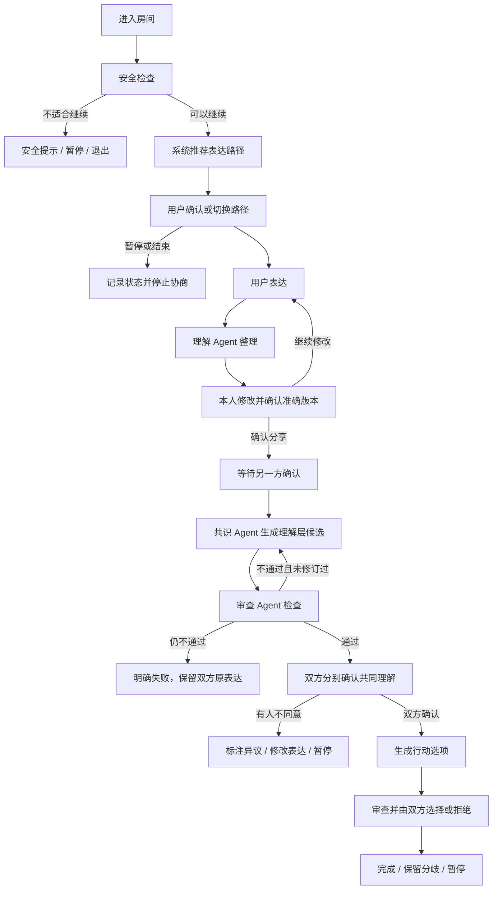

# 「说开」AI 协商产品规格

版本：v0.2

状态：M0 产品基线，待真实模型接入与离线评测

适用范围：双人沟通房间，H5 与微信小程序共用产品流程

## 1. 文档定位

本文档定义「说开」首版 AI 协商能力的用户流程、表达路径、Agent 职责、确认规则、安全边界和验收标准。

它解决的是“产品如何工作”，不是数据库或模型供应商的实现说明。技术设计、schema 方案和接口协议需要在进入实现前单独评审。

## 2. 产品目标

「说开」帮助仍愿意沟通的两个人：

1. 分别整理自己真正想表达的内容；
2. 在本人确认前保持内容私密；
3. 准确看见共同点与仍然存在的分歧；
4. 在不强迫立场一致的情况下，形成下一步行动、保留分歧或共同暂停。

一次有效沟通不等于达成一致。以下结果都属于有效结果：

- 双方更准确地理解了彼此；
- 事实争议被清楚保留，等待核实；
- 一方的边界被准确表达和尊重；
- 双方形成可调整、可退出的行动方案；
- 任意一方决定暂停或结束沟通。

## 3. 首版范围

### 3.1 包含

- 双人房间、独立身份和私人草稿；
- 四种表达路径；
- 理解 Agent、共识 Agent、审查 Agent；
- 用户逐阶段确认、修改、撤回和暂停；
- 理解层结果与行动层结果；
- 有限重生成与明确失败降级；
- 进入、生成、分享和行动建议阶段的安全检查；
- H5 与微信小程序一致的业务含义。

### 3.2 不包含

- AI 裁决哪一方正确；
- AI 代替用户自动发送或接受内容；
- Agent 自由辩论或主 Agent 动态规划；
- 无限重试和无限澄清；
- 多人房间；
- 治疗、法律裁决、危机干预或紧急救援；
- 影子运行；
- 未经双方确认的自动行动承诺。

## 4. 设计原则

### 4.1 用户拥有最终解释权

AI 输出始终是候选稿。只有用户确认的具体版本才代表该用户愿意分享的表达。

### 4.2 理解不等于同意

“共同理解”只表示双方确认系统准确呈现了共同点和分歧，不表示认错、原谅、放弃权利或接受行动方案。

### 4.3 不制造虚假共识

系统必须允许并清楚展示“双方仍然不同意”。无法形成共同表述时，应分别呈现双方立场，而不是生成听起来和谐但没有依据的总结。

### 4.4 边界优先于推进流程

任何一方选择暂停、结束或声明不可协商的边界后，系统不得为了完成率继续推动共识或行动建议。

### 4.5 未核实内容只作为参与者主张

系统可以整理“甲认为发生了 X”，不能把 X 写成已经验证的事实。

### 4.6 私密内容默认不共享

原始录音、转写、私人草稿、被用户删除的版本和内部审查信息不自动分享给另一方。分享前必须展示将要分享的准确内容。

## 5. 表达路径

系统可以推荐路径，但不能替用户决定。用户在本人确认前可以切换路径。

| 路径 | 适用情况 | 结构 | 明确限制 |
| --- | --- | --- | --- |
| 非暴力沟通 | 想表达一件事带来的感受、需要和请求 | 观察、感受、需要、请求 | 不把评价写成观察，不把要求写成需要 |
| 事实争议 | 双方对发生了什么存在不同说法 | 我的主张、依据、不确定点、希望核实的事项 | AI 不判断真伪，不给任何一方定性 |
| 边界声明 | 需要拒绝、停止某种行为或明确底线 | 边界、原因、可接受范围、越界后的自我保护行动 | 不要求用户把边界包装成温和请求 |
| 暂停或结束 | 现在不愿意或不适合继续 | 暂停原因（可选）、是否允许恢复、恢复条件（可选） | 不进入共识生成，不强迫填写原因 |

### 5.1 路径推荐

路径推荐属于系统能力，不属于理解 Agent。推荐器只输出：

- 推荐路径；
- 一句用户可理解的理由；
- 其他三条可选路径；
- 是否需要先显示安全提示。

推荐器不得隐藏其他路径，也不得因用户拒绝推荐而降低功能。

## 6. Agent 与程序的职责

### 6.1 程序

程序负责确定性流程：

- 房间身份、权限和阶段；
- 路径推荐结果展示与用户选择；
- 草稿、确认版本、撤回和暂停；
- 判断双方是否满足下一阶段条件；
- 发起有次数上限的模型任务；
- 把输出绑定到准确的输入版本；
- 在任何输入变化时使旧结果和旧确认失效；
- 超时、失败、重复请求和恢复；
- 不依赖模型的硬性隐私与安全规则。

### 6.2 理解 Agent

理解 Agent 每次只服务一个参与者。

职责：

- 按用户已选择的路径整理表达；
- 保留原意、语气强度、不确定性和边界；
- 标记事实与推测混合、信息缺失或歧义；
- 必要时提出至多一个高价值澄清问题；
- 生成可编辑候选稿，并说明其依据来自原表达的哪一部分。

禁止：

- 选择表达路径；
- 判断谁对谁错；
- 查看另一方私人草稿；
- 替用户软化边界或增加用户没有表达的请求；
- 生成双方共同结论。

### 6.3 共识 Agent

共识 Agent 只有在双方都确认可分享版本后才能运行。

第一次调用生成理解层候选结果：

- 双方明确共有的内容；
- 信息不一致、理解不同、需要冲突或价值差异；
- 尚未核实的事实争议；
- 双方各自不可跨越的边界；
- 当前最值得共同回答的问题；
- 无法合并时并列呈现双方的说法。

第二次调用生成行动层候选结果：

- 二至三个可选行动方案；
- 每个方案回应的共同点和限制；
- 适用范围、试行时间、复盘方式和退出条件；
- 尚未解决、不能被行动方案掩盖的分歧。

禁止：

- 使用未确认草稿；
- 把单方诉求写成双方共识；
- 越过边界生成折中方案；
- 将未经核实的主张写成事实；
- 用“双方都有责任”等措辞制造表面对称。

### 6.4 审查 Agent

审查 Agent 判断候选结果是否可展示，不直接重写结果。

检查项：

- 遗漏；
- 原意弱化、强化或曲解；
- 无依据推断；
- 虚假共识；
- 单方偏向；
- 事实状态错误；
- 边界侵犯；
- 不可执行或不可退出的行动方案；
- 操纵、威胁、自伤他伤等安全风险。

输出为“通过”或“不通过＋结构化问题列表”。同一候选阶段最多允许共识 Agent 修订一次。仍不通过时停止自动生成并向用户说明本次未能生成可靠结果。

审查 Agent 与共识 Agent 即使使用不同提示词，也不能对用户声称为完全独立的第三方裁决。

## 7. 用户主流程

## 8. 页面与交互规格

### 8.1 房间说明

用户进入表达前必须看见：

- AI 会怎样整理内容；
- 哪些内容现在是私密的；
- 什么时候会分享给对方；
- AI 不会判断谁正确；
- 用户随时可以暂停或退出；
- 紧急危险不适合使用本产品解决。

### 8.2 路径选择

页面展示一个推荐路径和四个完整选项。推荐理由必须是描述性的，例如“你提到了对事情经过的不同说法”，不能使用诊断性措辞。

用户操作：

- 采用推荐；
- 查看并选择其他路径；
- 直接暂停；
- 返回修改原始表达。

### 8.3 私密表达

始终展示“仅自己可见”。支持文字和现有语音转写能力；转写结果必须可编辑。

用户可以：

- 保存本机草稿；
- 请求 AI 整理；
- 不使用 AI，直接按结构填写；
- 清空草稿；
- 暂停或退出。

### 8.4 理解结果确认

页面同时展示：

- 用户原始表达；
- AI 整理后的结构化候选稿；
- 不确定或待本人确认的内容；
- AI 是否提出了一个澄清问题；
- “对方将看到什么”的准确预览。

主操作必须是“确认并分享这个版本”，不能使用含糊的“继续”。确认前说明：分享后对方可能已经阅读，撤回不能保证对方忘记已看到的内容。

### 8.5 等待对方

只显示对方进度类别，例如“尚未加入 / 正在整理 / 已确认”。不展示对方草稿、输入长度、路径选择或安全状态。

用户仍可进入自己的空间、查看本人已分享版本、撤回后续处理权限或暂停房间。

### 8.6 共同理解

按以下顺序展示：

1. 双方明确共同点；
2. 仍然不同的地方；
3. 尚未核实的事实；
4. 已声明的边界；
5. 候选共同理解；
6. 核心问题。

每一方分别选择：

- “准确表达了我的意思”；
- “有一处不准确”，并定位问题；
- “我需要修改自己的表达”；
- “我想暂停”。

页面固定说明：“确认准确不代表同意对方，也不代表接受下一步方案。”

### 8.7 行动选项

每个行动选项展示：

- 要做什么；
- 谁需要做；
- 从什么时候开始；
- 试行多久；
- 怎样复盘；
- 如何拒绝、调整或退出；
- 它没有解决的分歧。

双方可以选择同一方案、继续修改、暂不行动或结束沟通。产品不得把“没有行动共识”显示为失败。

## 9. 确认、版本和撤回规则

1. 所有确认必须绑定到用户实际看到的候选版本。
2. 用户编辑内容后生成新版本，旧确认立即失效。
3. 任意一方修改已确认表达后，基于旧版本生成的共同理解、审查结果和行动方案全部失效。
4. 模型任务结果必须绑定双方输入版本和流程版本，迟到的旧结果不得覆盖新结果。
5. 用户撤回尚未分享的内容时，应停止后续任务并删除可删除的私人副本。
6. 已分享内容的撤回必须诚实说明边界：系统可停止继续处理或展示，但不能保证对方没有看见或自行保存。
7. 双方确认共同理解后，仍可拒绝进入行动层。

## 10. 安全与退出

安全检查不是只有入口一次，而是在以下节点重复执行：

- 原始表达提交后；
- 理解候选生成后；
- 共同理解生成后；
- 行动建议生成后。

发现潜在风险时，产品可以：

- 阻止自动分享；
- 不生成可能导致面对面对质的行动建议；
- 建议暂停或离开当前环境；
- 展示与风险类型相匹配的求助提示；
- 允许安静退出，不向另一方透露具体风险判断。

系统不能保证紧急救援，也不能以安全提示替代用户所在地区的专业支持。

## 11. 产品状态

以下是产品状态，不等同于最终数据库枚举：

| 状态 | 含义 | 可进入下一阶段的条件 |
| --- | --- | --- |
| 房间准备 | 发起者设置目标并邀请对方 | 房间创建成功 |
| 私密表达 | 当前参与者输入、选择路径并整理 | 本人确认准确分享版本 |
| 等待另一方 | 一方已确认，另一方未确认 | 双方都有有效确认版本 |
| 生成共同理解 | 共识与审查任务运行中 | 审查通过或明确失败 |
| 确认共同理解 | 双方分别确认候选结果 | 双方均确认，或有人暂停/退回 |
| 生成行动选项 | 生成并审查行动候选 | 审查通过或明确失败 |
| 确认行动 | 双方选择、修改或拒绝行动 | 双方达成方案或选择结束 |
| 暂停 | 暂时不继续 | 满足恢复条件并重新确认当前版本 |
| 结束 | 不再继续当前房间 | 终态 |

每个运行中状态还必须有：空闲、处理中、失败可重试、失败不可自动重试四种任务状态。

## 12. 异常与降级

- 路径推荐失败：展示四条路径，由用户自己选择。
- 理解 Agent 失败：保留输入，允许重试或切换到手动结构填写。
- 共识 Agent 失败：保留双方确认表达，不展示半成品。
- 审查不通过：最多修订一次；仍不通过则停止自动生成。
- 网络中断：不重复提交确认；恢复后读取服务端准确状态。
- 结果格式错误：视为生成失败，不尝试从不完整文本猜测。
- 一方长期未回应：另一方可以暂停、退出或保留已分享版本，不自动替对方作决定。
- 一方修改或撤回：使所有受影响的下游候选失效，并明确提示另一方内容正在更新。

## 13. 数据与隐私边界

- 前端不得显示或记录 access token、JWT、内部用户 ID 或模型密钥。
- 私人草稿与可分享确认版本必须是不同的数据对象和权限范围。
- Agent 只能获得当前任务所需的最小字段。
- 日志默认不记录原始私密内容；仅记录任务 ID、版本、状态、耗时和错误类别。
- 模型供应商、保存期限、是否用于训练和删除能力必须在接入前形成明确说明。
- 所有真实房间数据继续通过现有 Supabase RLS 隔离；不能依赖前端隐藏实现权限。

## 14. 首版产品验收标准

### 14.1 正常流程

- 双方可以选择相同或不同表达路径并完成协商；
- 对方确认前，任何一方都无法读取对方私人草稿；
- 每个 AI 结果都能追溯到明确的已确认输入版本；
- 用户看见将要分享的准确内容后才可确认；
- 共同理解明确区分共同点、分歧、未核实事实和边界；
- 双方可以不形成行动方案而正常结束。

### 14.2 修改与并发

- 编辑已确认表达后，旧的共同理解与行动确认全部失效；
- 重复点击、网络重试和迟到任务不会产生重复确认或覆盖新版本；
- 刷新、退出重进和跨端恢复不会跳过必要确认；
- 双方同时操作时，房间进入唯一合法状态。

### 14.3 安全与诚实表达

- 任意阶段都能找到暂停和退出入口；
- 安全分流不会向另一方泄露用户的风险判断或求助选择；
- 产品不把参与者主张包装成已核实事实；
- 产品不把确认准确包装成同意、原谅或承诺；
- AI 或审查失败时，页面明确显示真实状态，不使用模拟结果冒充成功。

## 15. 待技术设计确认的事项

以下事项不在本文直接决定 schema：

- 表达版本、确认记录和候选结果的数据模型；
- 暂停、恢复、撤回和超时的服务端状态机；
- 模型任务的幂等、锁、重试和结果版本绑定；
- 私人草稿与共享版本的 RLS 策略；
- 模型供应商、数据保留和区域；
- 安全分类规则、人工求助文案和运营处理边界。
