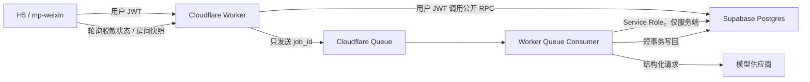
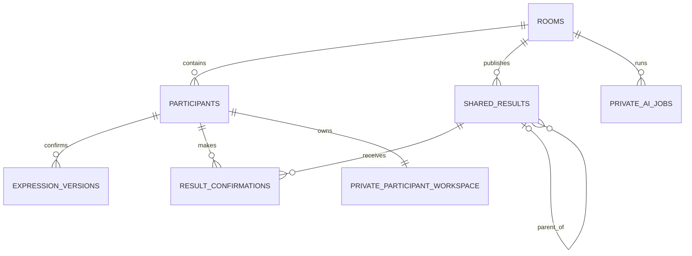

# 「说开」AI 协商技术设计

版本：v0.1

状态：M1 设计已进入功能分支实现；migration 尚未应用到线上 schema

关联文档：

- [AI 协商产品规格](./ai-negotiation-product-spec.md)
- [AI 协商开发计划](./ai-negotiation-development-plan.md)

## 1. 设计结论

首版采用以下架构：



职责边界：

- Supabase Auth：签发和验证参与者身份；
- Supabase Postgres：房间权威状态、不可变版本、确认、RLS、任务幂等和审计；
- Cloudflare Worker：HTTP 边界、参数校验、模型密钥、任务生产与消费；
- Cloudflare Queue：模型任务的可靠异步投递和自动重试；
- 模型供应商：只处理当前任务需要的最小内容，不拥有流程状态或授权决策；
- 客户端：展示真实状态，不保存服务端密钥，不决定权限和阶段跳转。

本设计不新增 Supabase Edge Function 作为 AI 编排层。仓库已经以 Cloudflare Worker 作为 H5、微信和未来 App 的统一服务端入口，再增加一套 Edge Function 会形成两套鉴权、日志、重试和部署路径。

## 2. 官方文档核对结论

设计依据为 2026-08-10 可用的官方文档：

1. Supabase 要求暴露 schema 中的表启用 RLS；通过 SQL 创建的新表不应假定会自动暴露给 Data API，必须显式配置权限。
2. 数据库函数默认可被 `PUBLIC` 执行，公开 RPC 必须先撤销默认权限，再只授予所需角色。
3. `SECURITY INVOKER` 应优先使用；确需 `SECURITY DEFINER` 时必须清空 `search_path`、全限定表名并在函数体内显式验证 `auth.uid()` 和资源归属。
4. 外部模型调用不能放在数据库事务中，避免长事务持锁。
5. Supabase Edge Function 与 Cloudflare Worker 的后台任务都有运行时终止边界，不能把一次后台 Promise 当作耐久队列。
6. Cloudflare `waitUntil()` 在响应或断开后最多继续 30 秒，不适合作为模型任务的可靠执行保证。
7. Cloudflare Queues 是至少一次投递，可能重复且不保证顺序，因此数据库必须实现幂等、版本校验和迟到结果拒绝。

截至该日期，Supabase changelog 中与本设计直接相关的变化是“新表不再自动暴露给 Data/GraphQL API”。方案因此对每张新表明确写出 schema、RLS 和 grant，而不依赖项目默认设置。

## 3. 当前实现盘点

### 3.1 当前数据对象

| 对象 | 当前用途 | 可否直接沿用 |
| --- | --- | --- |
| `rooms` | 房间、目标、单一线性状态、CAS 版本 | 保留身份字段，流程字段需要 v2 |
| `participants` | A/B 身份与用户绑定 | 保留，增加独立参与者进度 |
| `private_drafts` | 服务端私人原文与澄清 | 不直接扩展，v2 改为私有 schema 中的当前草稿 |
| `perspectives` | `fact/meaning/impact/request` 观点版本 | 不用于 v2，字段语义与 NVC 已错位 |
| `shared_views` | 每房间一行、覆盖更新的共同视图 | 不用于 v2，无法绑定准确输入版本 |
| `agreements` | 每房间一行、布尔确认 | 不用于 v2，无法支持候选版本和拒绝 |
| `room_events` | 房间状态事件 | 保留为脱敏用户事件，内部任务事件另存 |

### 3.2 当前安全优点

- 前端使用 publishable/anon key 与用户 JWT；
- Service Role 和模型密钥只存在 Worker Secret；
- 所有公开表已经启用 RLS；
- 客户端没有直接写表权限，业务写入通过 RPC；
- RPC 普遍使用空 `search_path` 和 `auth.uid()` 成员检查；
- 对方在共同阶段前读不到另一方 `private_drafts` 和 `perspectives`；
- Worker 对 RPC 方法和参数做 allowlist 校验。

### 3.3 当前阻塞问题

1. `rooms.state` 把 A、B 两条异步分支塞进一个线性状态，无法表示双方各自修改、暂停和确认。
2. `Perspective.meaning` 在界面中代表“感受”，`Perspective.impact` 代表“需要”，数据库字段和产品语义不一致。
3. `shared_views` 和 `agreements` 的唯一 `room_id` 行会被覆盖，旧确认无法证明确认的是哪份内容。
4. `accepted_a / accepted_b` 只表示布尔结果，没有候选 hash，也没有修改后自动失效机制。
5. `private.create_shared_view()` 仍是固定模板拼接，不是真实模型任务。
6. `private.transition_room()` 只比较状态，不校验调用者预期的房间版本和参与者版本。
7. 当前快照按房间阶段整体开放内容，无法表达“候选生成中、审查失败、结果已过期”。
8. 当前事件表适合用户可见流程，不适合保存模型错误、Token、provider request 等内部元数据。

## 4. 目标状态模型

房间只保存双方共享阶段；每位参与者的私密分支状态保存在参与者记录中。模型任务状态独立存在，不再把失败塞进房间阶段。

### 4.1 房间共享阶段

```text
SETUP
→ PRIVATE_EXPRESSION
→ UNDERSTANDING_GENERATING
→ UNDERSTANDING_CONFIRMING
→ ACTION_GENERATING
→ ACTION_CONFIRMING
→ COMPLETED
```

任意非终态都可以进入：

```text
PAUSED → 恢复到进入暂停前的合法阶段
ENDED  → 终态
```

生成失败不是新的房间阶段。房间保留在 `UNDERSTANDING_GENERATING` 或 `ACTION_GENERATING`，同时通过当前任务状态显示：

- `QUEUED`；
- `PROCESSING`；
- `FAILED_RETRYABLE`；
- `FAILED_FINAL`；
- `SUCCEEDED`；
- `STALE`；
- `CANCELED`。

### 4.2 参与者分支状态

```text
INVITED
→ DRAFTING
→ AI_REVIEW
→ CONFIRMED
→ REVISING
→ CONFIRMED
```

任意非终态可以进入 `PAUSED` 或 `ENDED`。一方进入 `PAUSED` 时，房间共享流程停止；另一方只能看到“对方暂停了当前沟通”，不能看到暂停原因、安全分类或求助选择。

### 4.3 关键转换

| 操作 | 前置条件 | 原子结果 |
| --- | --- | --- |
| 选择表达路径 | 本人处于 `DRAFTING/REVISING` | 更新本人模式与参与者版本 |
| 请求理解整理 | 草稿 revision 与客户端一致 | 创建幂等 AI job，不推进共享阶段 |
| 确认分享版本 | 本人看到准确预览，草稿未变化 | 插入不可变表达版本，更新 current 指针 |
| 双方表达确认 | A/B current 指针均有效 | 房间进入 `UNDERSTANDING_GENERATING` 并创建任务 |
| 发布共同理解 | 共识及审查通过，输入版本仍是当前版本 | 插入不可变共享结果，进入确认阶段 |
| 一方开始修改 | 非终态且本人仍是成员 | 下游候选作废，房间回到私密表达阶段 |
| 双方确认共同理解 | 两个确认绑定同一候选 hash | 进入 `ACTION_GENERATING` |
| 双方选择同一行动 | 两个确认绑定同一候选与选项 | 房间进入 `COMPLETED` |
| 任意一方暂停 | 非终态 | 保存原阶段、进入 `PAUSED`、取消未开始任务 |
| 恢复 | 暂停方主动恢复且输入仍有效 | 回到原合法阶段；必要时重新确认 |

所有转换同时比较 `rooms.version` 和相关 `participants.version`，冲突返回现有的 `40001` 类用户提示，不靠“最后写入者获胜”。

## 5. 目标数据模型

以下是逻辑 schema 草案，不是 migration SQL。



### 5.1 现有表扩展

#### `public.rooms`

保留 `id/code/goal/created_by/expires_at`，v2 增加：

| 字段 | 类型 | 说明 |
| --- | --- | --- |
| `workflow_version` | `smallint` | `1` 为旧流程，`2` 为 AI 协商流程 |
| `phase_v2` | `text` | v2 共享阶段；迁移期不覆盖旧 `state` |
| `resume_phase_v2` | `text null` | 暂停前阶段 |
| `paused_by_participant_id` | `uuid null` | 只用于权限和恢复，不向对方返回具体风险 |
| `current_understanding_result_id` | `uuid null` | 当前可确认的理解层候选 |
| `current_action_result_id` | `uuid null` | 当前可确认的行动层候选 |
| `ended_at` | `timestamptz null` | 房间结束时间 |

继续使用现有 `version` 作为房间 CAS 版本，改为每次共享状态变化都递增。

两个 current result 外键在 `shared_results` 创建后再增加；RPC 还要检查结果属于同一房间和正确的 `result_type`。

#### `public.participants`

增加：

| 字段 | 类型 | 说明 |
| --- | --- | --- |
| `public_progress_v2` | `text` | 对方可见的粗粒度进度：`NOT_JOINED/ORGANIZING/CONFIRMED/PAUSED/ENDED` |
| `version` | `bigint` | 参与者分支 CAS 版本 |
| `current_expression_id` | `uuid null` | 当前愿意分享的表达版本 |
| `paused_at` | `timestamptz null` | 本人暂停时间 |
| `ended_at` | `timestamptz null` | 本人结束时间 |

`current_expression_id` 在创建新表达表后再增加外键。RPC 还要检查该表达确实属于同一 `participant_id` 和 `room_id`。

详细 `flow_state`、`selected_mode` 和 `draft_revision` 不放在双方可读的 `participants` 行，避免对方在本人确认前推断其路径选择、安全状态或具体编辑进度。

### 5.2 新增公开表

#### `public.expression_versions`

只保存本人明确确认可分享的内容，不保存原录音或私人原文。

| 字段 | 类型 | 约束 |
| --- | --- | --- |
| `id` | `uuid` | 主键 |
| `room_id` | `uuid` | 外键，级联删除并建立索引 |
| `participant_id` | `uuid` | 外键，级联删除并建立索引 |
| `owner_user_id` | `uuid` | 外键，RLS 所有者检查并建立索引 |
| `version` | `bigint` | 每位参与者递增，`unique(participant_id, version)` |
| `mode` | `text` | 四种表达路径 check |
| `payload` | `jsonb` | 路径对应结构，必须是对象且大小受限 |
| `schema_version` | `smallint` | 输出结构版本 |
| `content_hash` | `text` | 服务端标准化内容 SHA-256 |
| `confirmed_at` | `timestamptz` | 用户确认时间 |

内容列创建后禁止 UPDATE；状态变化通过参与者 current 指针和事件表达。

不为 `payload` 建 GIN 索引：首版不会按内部字段检索，只按主键、房间和参与者读取，避免无收益的写入成本。

#### `public.shared_results`

只保存通过审查、可以展示给双方的共同理解或行动候选。未通过审查的模型输出留在 private schema。

| 字段 | 类型 | 约束 |
| --- | --- | --- |
| `id` | `uuid` | 主键 |
| `room_id` | `uuid` | 外键并建立索引 |
| `result_type` | `text` | `UNDERSTANDING/ACTION` |
| `version` | `bigint` | `unique(room_id, result_type, version)` |
| `expression_a_id` | `uuid` | 绑定 A 的准确表达版本 |
| `expression_b_id` | `uuid` | 绑定 B 的准确表达版本 |
| `parent_result_id` | `uuid null` | ACTION 绑定已确认 UNDERSTANDING |
| `payload` | `jsonb` | 经过审查的候选内容 |
| `schema_version` | `smallint` | 结果结构版本 |
| `content_hash` | `text` | 用户确认绑定 hash |
| `published_at` | `timestamptz` | 审查通过并发布的时间 |

对两个表达外键、`parent_result_id` 和 `room_id` 建索引。插入时由服务端重新确认 A/B 表达仍是参与者 current 指针。

#### `public.result_confirmations`

每名参与者对一个共享候选最多有一个当前有效决定；用户撤销或改变决定时，旧决定失效并追加新版本。修改候选内容会产生新的 `shared_results` 行。

| 字段 | 类型 | 约束 |
| --- | --- | --- |
| `id` | `uuid` | 主键 |
| `room_id` | `uuid` | 外键并建立索引 |
| `result_id` | `uuid` | 外键并建立索引 |
| `participant_id` | `uuid` | 外键并建立索引 |
| `version` | `bigint` | 每位参与者对该候选递增 |
| `decision` | `text` | `ACCURATE/INACCURATE/SELECTED/REJECTED/PAUSED` |
| `selected_option_key` | `text null` | ACTION 选择的稳定选项 key |
| `candidate_hash` | `text` | 必须等于当时展示的候选 hash |
| `created_at` | `timestamptz` | 决定时间 |
| `invalidated_at` | `timestamptz null` | 上游改变时由服务端标记失效 |

建立 `unique(result_id, participant_id, version)`，并对 `invalidated_at is null` 建立“每人每候选最多一个有效决定”的 partial unique index。用户的文字反馈不放在公开表，避免另一方从数据库读取未授权的修改意见。

### 5.3 新增私有表

private schema 不暴露给 Data API，不向 `anon/authenticated` 授予表权限；仍启用 RLS 作为纵深防御。

#### `private.participant_workspaces_v2`

每名参与者一行当前私密工作区，使用 revision 做乐观并发：

- `room_id/participant_id/owner_user_id`；
- `revision bigint`；
- `flow_state`；
- `source_text`；
- `selected_mode`；
- `manual_payload jsonb`；
- `ai_candidate_payload jsonb null`；
- `pending_feedback_result_id uuid null`；
- `pending_feedback_text text null`；
- `source_hash`；
- `updated_at`。

原始录音不进入此表；现有转写接口只返回文本。草稿更新必须传 `expected_revision`，不允许盲目覆盖。

“有一处不准确”的本人反馈也保存在该私有 workspace，绑定准确的 `result_id`。生成下一版候选或用户清空反馈后覆盖，不额外创建反馈表。

#### `private.ai_jobs`

| 字段组 | 关键字段 |
| --- | --- |
| 身份 | `id/room_id/requested_by_participant_id/job_type` |
| 输入绑定 | `draft_revision/expression_a_id/expression_b_id/parent_result_id/input_hash` |
| 版本 | `pipeline_version/prompt_version/schema_version/model_id` |
| 执行 | `status/attempt_no/semantic_attempt/parent_job_id/lease_until/locked_by` |
| 幂等 | `idempotency_key unique` |
| 结果 | `result_payload/review_issues/safety_disposition/risk_categories/error_code` |
| 运营 | `provider_request_ref/token_input/token_output/latency_ms/created_at/started_at/finished_at` |

`provider_request_ref` 只保存供应商请求标识或其 hash，不保存密钥。`error_code` 使用内部枚举，不保存可能含原文的异常堆栈。

索引：

- `(room_id, created_at desc)`；
- `(status, lease_until)`，仅覆盖可领取状态的 partial index；
- `(requested_by_participant_id, created_at desc)`；
- `idempotency_key unique`；
- 对同一输入、任务类型和 pipeline 的活动任务建立 partial unique index。

安全检查本身作为 `SAFETY_*` 类型的 `private.ai_jobs` 保存，使用同一套输入 hash、版本、结果和审计字段，不额外创建安全检查表。暂停原因、风险分类和求助选择不进入用户共享快照。

### 5.4 旧表处理

不把 v1 `perspectives` 自动转换成 NVC 表达，因为 `meaning/impact` 的历史语义不可靠，自动转换会制造错误数据。

迁移期：

- v1 房间继续由 `workflow_version = 1` 读取旧表；
- 新建房间使用 `workflow_version = 2` 和新表；
- v2 稳定前不删除旧表和旧 RPC；
- 若确认测试环境没有需要保留的 v1 房间，清理仍作为单独、需批准的破坏性 migration。

## 6. 路径 payload 契约

所有 payload 都带 `mode` 和 `schemaVersion`，只允许已定义字段。模型输出先由 Worker JSON Schema 校验，再由数据库 RPC 做模式、大小和必要字段校验。

### 6.1 非暴力沟通

```json
{
  "mode": "NVC",
  "schemaVersion": 1,
  "observation": "可观察的事件",
  "feeling": "本人的感受",
  "need": "感受背后的需要",
  "request": "具体、可拒绝的请求",
  "uncertainties": []
}
```

### 6.2 事实争议

```json
{
  "mode": "FACT_DISPUTE",
  "schemaVersion": 1,
  "claim": "本人主张发生的事情",
  "basis": ["本人认为支持该主张的信息"],
  "uncertainties": ["尚不能确认的内容"],
  "verificationRequests": ["希望共同核实的事项"]
}
```

### 6.3 边界声明

```json
{
  "mode": "BOUNDARY",
  "schemaVersion": 1,
  "boundary": "本人不接受或需要停止的行为",
  "reason": "愿意分享的原因",
  "acceptableRange": "可以接受的范围",
  "selfProtectiveAction": "再次越界时本人会采取的行动"
}
```

### 6.4 暂停或结束

```json
{
  "mode": "PAUSE",
  "schemaVersion": 1,
  "resumeAllowed": true,
  "resumeCondition": "可选的恢复条件"
}
```

暂停原因不是必填字段，也不默认分享给另一方。

`PAUSE` payload 只保存在本人的 private workspace。确认暂停时调用 `pause_room_v2`，不插入 `public.expression_versions`，也不触发共识任务；对方只收到粗粒度暂停状态。

## 7. 模型任务编排

### 7.1 任务类型

| job type | 输入 | 成功结果去向 |
| --- | --- | --- |
| `ROUTE` | 本人当前草稿 hash 和最小文本 | 私人草稿中的路径建议 |
| `SAFETY_EXPRESSION` | 本人表达 | 对应 `private.ai_jobs` 的安全结果字段 |
| `UNDERSTAND` | 本人选定路径与草稿 | 私人理解候选 |
| `CONSENSUS` | 双方 current 表达版本 | 私有共同理解候选 |
| `REVIEW_UNDERSTANDING` | 双方表达＋候选 | 通过后发布 `shared_results` |
| `ACTION` | 已确认理解结果＋边界 | 私有行动候选 |
| `REVIEW_ACTION` | 行动候选＋上游依据 | 通过后发布 `shared_results` |
| `SAFETY_RESULT` | 准备发布的候选 | 对应 `private.ai_jobs` 的安全结果字段 |

安全检查是系统能力，不新增一个对用户可见的“安全 Agent”角色。

### 7.2 调用上限

- ROUTE：最多一次；失败后手动选择。
- UNDERSTAND：每个草稿 revision 默认一次；用户明确请求后可再生成一次。
- CONSENSUS＋REVIEW：审查不通过时最多一次语义修订。
- ACTION＋REVIEW：审查不通过时最多一次语义修订。
- 网络重试与语义修订分开计数；网络重试不能悄悄增加语义版本。

### 7.3 队列消息

```json
{
  "jobId": "uuid"
}
```

队列中不放房间原文、结构化表达、用户 ID、JWT、模型密钥或安全分类。

### 7.4 消费流程

1. Queue Consumer 收到 `jobId`。
2. 通过内部 RPC 原子领取任务；已完成、取消或过期任务直接 ack。
3. 从 Supabase 读取该任务绑定的准确输入版本。
4. 再次校验任务未过期、房间未暂停、输入仍是 current。
5. 在数据库事务之外调用模型。
6. 校验 HTTP 状态、JSON Schema、字段长度和禁止字段。
7. 用一个短事务写回结果；事务内再次比较输入版本和房间版本。
8. 若输入已变化，标记 `STALE`，不发布结果。
9. 若需要下一个审查任务，先创建幂等 job，再发送新的 `jobId`。
10. 只有数据库达到终态后才 ack；可重试错误交给 Queue 重投。

## 8. 幂等、并发与迟到结果

### 8.1 幂等键

服务端生成：

```text
sha256(
  job_type
  + target_input_hash
  + pipeline_version
  + prompt_version
  + semantic_attempt
)
```

客户端不能自定义最终幂等键，只能携带一次操作 request ID 供日志关联。

### 8.2 领取租约

Queue Consumer 通过单条条件 UPDATE 领取任务：

- 仅 `QUEUED/FAILED_RETRYABLE` 或租约已过期的 `PROCESSING` 可领取；
- 设置 `locked_by/lease_until/started_at`；
- 同一 job 的重复消息只有一个消费者获得有效租约；
- 结果写回必须匹配当前 `locked_by` 和未过期租约。

### 8.3 迟到结果

结果写回必须同时满足：

- 房间仍存在且未结束；
- 房间版本与任务允许的阶段一致；
- A/B current expression ID 与任务输入相同；
- parent result 仍是当前且已得到要求的双方确认；
- pipeline、prompt 和 schema 版本匹配；
- 任务没有被取消或标记 stale。

任一条件不满足都只标记 `STALE`，不能覆盖新结果，也不能把房间推进到下一阶段。

### 8.4 锁顺序

需要同时锁多行的 RPC 使用固定顺序：

1. `rooms`；
2. `participants`，按 role 或 ID 排序；
3. 当前表达版本；
4. 当前 shared result；
5. confirmations/job。

事务中不发 HTTP 请求，不等待 Queue，不调用模型。

## 9. RLS 与权限矩阵

### 9.1 总体规则

- `anon`：不能访问业务表或 RPC；
- `authenticated`：只能执行显式公开 RPC，并 SELECT 允许展示的公开表；
- `service_role`：仅 Cloudflare Worker Secret 使用；
- 客户端永远不拿 Service Role、模型密钥或微信密钥；
- 新公开表先启用 RLS，再显式 grant；
- 新函数创建后立即 revoke `PUBLIC/anon/authenticated`，最后只 grant 必需签名；
- 不使用 `raw_user_meta_data` 做授权；房间授权只根据 `auth.uid()` 和 participants 关系。

### 9.2 表权限

| 表 | 本人 | 对方 | 无关登录用户 | Worker Service Role |
| --- | --- | --- | --- | --- |
| `rooms` | 读成员房间 | 同左 | 无 | 管理任务时读写 |
| `participants` | 读粗粒度成员进度 | 同左 | 无 | 读写公开进度和 current 指针 |
| `expression_versions` | 读本人所有确认版本 | 只读对方 current 且已分享版本 | 无 | 按任务读取 |
| `shared_results` | 读本房间已发布结果 | 同左 | 无 | 发布新版本 |
| `result_confirmations` | 读本房间决定状态 | 同左，不含私密反馈 | 无 | 使旧确认失效 |
| `room_events` | 读本房间脱敏事件 | 同左 | 无 | 写脱敏事件 |
| `private.participant_workspaces_v2` | 专用 RPC 返回本人当前草稿和本人反馈 | 无 | 无 | 按任务最小读取 |
| `private.ai_jobs` | 专用 RPC 只返回状态和安全错误码 | 无原始结果 | 无 | 完整读写 |

公开表不授予客户端 INSERT/UPDATE/DELETE；所有写入走校验当前用户和 expected version 的 RPC。

### 9.3 公开 RPC

建议 v2 使用新签名，避免悄悄改变旧客户端语义：

- `create_room_v2`；
- `select_expression_mode_v2`；
- `save_expression_draft_v2`；
- `confirm_expression_version_v2`；
- `begin_expression_revision_v2`；
- `record_result_decision_v2`；
- `pause_room_v2`；
- `resume_room_v2`；
- `end_room_v2`；
- `get_room_snapshot_v2`；
- `get_ai_job_status_v2`。

跨 private schema 写入和完整状态事务可以使用 `SECURITY DEFINER`，但每个函数必须：

1. `set search_path = ''`；
2. 所有 relation 使用 schema 全限定名；
3. 函数开头读取并验证 `(select auth.uid())`；
4. 查询当前参与者并验证 room membership；
5. 检查 expected room/participant/draft version；
6. 不接受客户端传入 `owner_user_id/participant_id/role` 作为授权依据；
7. 返回明确的有限字段，不 `to_jsonb(table_row)` 整行返回；
8. 撤销默认 execute，仅授予 `authenticated`。

当前 Worker 通过 `supabase-js` 的 Data API 调用 RPC，没有直连 Postgres。因此内部任务 RPC 使用现有身份桥相同的模式：函数放在 `public`、使用 `internal_` 前缀、撤销 `PUBLIC/anon/authenticated`，只 grant `service_role`。函数所操作的表仍在 non-exposed private schema。用于 RLS 的纯辅助函数可以保留在 private schema，不作为远程 API 暴露。

## 10. HTTP 接口

### 10.1 继续使用 `/miniapp-api`

普通业务 RPC 继续通过现有 allowlist：

- Worker 用 publishable key＋用户 JWT 创建 Supabase client；
- `auth.getClaims(jwt)` 验证 JWT；
- Postgres RPC 内的 `auth.uid()` 完成最终资源授权；
- Worker 只返回白名单错误文案。

v2 RPC 必须有独立参数规格，拒绝额外字段和超长 JSON。

### 10.2 新增 `/ai/jobs`

`POST /ai/jobs`

- 输入：`roomId/jobType/expectedDraftRevision` 或明确上游 result ID；
- 认证：用户 JWT；
- 处理：用户态 RPC 创建或复用幂等 job，随后发送 Queue；
- 返回：`202 { jobId, status }`；
- Queue 发送失败：保留可重试 job，返回真实 503，不伪装为处理中。

`GET /ai/jobs/:id`

- 只返回本人有权查看的脱敏状态；
- 不返回 prompt、原始 provider 输出、Token、模型密钥或另一方私人内容；
- 终态给出稳定用户错误类型和可继续操作。

房间级共识与行动任务由服务端在双方确认事务中自动创建，不允许客户端任意指定 A/B 输入版本。

### 10.3 Queue 环境隔离

测试阶段建议创建独立资源：

- producer/consumer queue：`shuokai-ai-jobs-test`；
- dead-letter queue：`shuokai-ai-jobs-test-dlq`。

绑定只写入 `cloudflare/wrangler.test.jsonc`。生产 `cloudflare/wrangler.jsonc` 不增加 Queue 绑定，也不创建生产 Queue，除非后续收到明确生产授权。

## 11. 安全检查落点

| 节点 | 检查对象 | 可能动作 |
| --- | --- | --- |
| 原始表达后 | 本人原文 | 允许、提醒、阻止分享、暂停 |
| 理解候选后 | 候选是否扭曲风险和边界 | 允许、要求本人确认、阻止自动分享 |
| 共同理解后 | 是否泄露私密内容、制造虚假共识或诱发对质 | 允许、退回一次、最终失败 |
| 行动建议后 | 是否越界、不可退出或增加现实风险 | 允许、退回一次、最终失败 |

硬规则由程序执行，例如：

- 一方选择暂停后不得创建后续共识任务；
- 边界路径中不存在“双方折中后可以越过边界”的自动转换；
- 未审查候选不得进入 `public.shared_results`；
- 被标记 `BLOCK_SHARE` 的内容不得通过普通确认 RPC 分享；
- 安全分类和暂停原因不得出现在对方快照或队列消息中。

模型安全分类只能作为一层检测，不能对外承诺绝对识别或完全独立判断。

## 12. 可观察性与日志

允许记录：

- `job_id`、房间 ID 的不可逆 hash；
- job type、pipeline/prompt/model 版本；
- status、attempt、latency、Token 数；
- schema 校验错误类别；
- Supabase/模型/队列的脱敏错误码；
- stale、取消和重试原因类别。

禁止记录：

- JWT、refresh token、Service Role、模型密钥；
- 原始录音或完整转写；
- 私人草稿和私密反馈；
- 完整模型 prompt 或 output；
- 微信 openid/unionid；
- 可被另一方读取的安全分类。

Worker 捕获异常时先映射为内部错误码，再记录；不能直接 `console.error(error)` 输出可能包含 provider 请求体的对象。

## 13. Migration 计划

### 13.1 Migration A：纯新增基础

- 新增 v2 表、约束、索引；
- 所有新 public 表启用 RLS；
- private 表启用 RLS 且无客户端 grant；
- 增加表级默认权限检查；
- 不修改旧 RPC 行为，不回填旧语义字段。

### 13.2 Migration B：v2 RPC 与状态转换

- 新增 v2 用户 RPC；
- 新增 service-only job RPC；
- 显式 revoke/grant 每个函数；
- 设置或验证 public schema 的函数默认 execute 权限，避免后续新函数重新向 `PUBLIC` 开放；
- 增加 pgtap RLS、权限和状态测试；
- 新建房间才标记 `workflow_version = 2`。

### 13.3 应用切换

- Worker 增加 Queue producer/consumer 和 AI job API；
- H5/mp-weixin 只在测试环境使用 v2；
- 旧 v1 房间继续使用旧快照，不做影子模型调用；
- 完成离线评测和全链路测试后再决定是否停止创建 v1 房间。

### 13.4 Cleanup Migration

仅在单独批准后执行：

- 撤销旧写 RPC；
- 将旧房间设为只读或结束；
- 评估是否删除 `private_drafts/perspectives/shared_views/agreements`；
- 删除前导出需要保留的测试数据并验证无真实用户数据。

## 14. 回滚策略

采用 roll-forward，不编写会直接删除新用户数据的 down migration。

如果 v2 应用失败：

1. 回滚 Worker 与客户端到 v1 commit；
2. 停止 v2 Queue producer；
3. 暂停 Queue 消费，保留消息或转入 DLQ；
4. 撤销 v2 公开 RPC 的 `authenticated` execute；
5. 保留新增表供调查，不删除数据；
6. 已存在 v2 房间显示“功能维护中”，不能错误地用 v1 字段解析。

如果只是模型供应商失败：

- 保持 v2 数据结构；
- 关闭 AI 生成入口；
- 允许用户使用手动模板完成本人表达；
- 不生成伪造的共同理解。

## 15. 测试设计

### 15.1 SQL / pgtap

角色至少包含 A、B、无关用户 C、未登录 anon：

- A/B 可以读取自己的房间，C/anon 不可读取；
- B 在 A 确认分享前读不到 A 私人草稿或候选；
- B 只能读取 A 的 current 已分享表达，不能枚举旧版本；
- 私密反馈、安全检查和 AI 原始输出对另一方不可见；
- authenticated 不能直接 INSERT/UPDATE/DELETE 新表；
- authenticated 不能执行 internal RPC；
- Service Role 的内部 RPC 仍必须校验 job 状态和版本；
- 所有 public 表启用 RLS；
- 所有外键列有对应索引；
- 所有新函数的 `PUBLIC/anon` execute 已撤销。

### 15.2 状态与并发

- 同一草稿 revision 重复请求只创建一个 job；
- Queue 重复投递只产生一个有效结果；
- A/B 同时确认共同理解，房间只推进一次；
- 模型运行时 A 修改表达，旧结果成为 `STALE`；
- 暂停与结果写回同时发生时，暂停优先且结果不发布；
- 两个消费者同时领取同一 job，只有一个得到租约；
- 租约过期后可以安全重领；
- 网络重试不消耗语义修订次数；
- 超过一次语义修订后进入 `FAILED_FINAL`。

### 15.3 Worker

- JWT 无效、来源不允许、配置缺失、请求过大；
- AI API allowlist 和 JSON Schema；
- Queue 发送失败返回真实 503；
- Queue 消息无敏感内容；
- provider 超时、429、5xx、非法 JSON、缺字段和超长字段；
- 日志不包含 Authorization、prompt 和 output；
- DLQ 与 retry 分类；
- 只有通过审查的候选被发布。

### 15.4 客户端

- 四条路径及不同路径组合；
- 草稿、保存中、已保存、生成中、失败、过期；
- 确认按钮展示准确分享内容与影响；
- 编辑后旧共同理解立即隐藏并显示更新状态；
- 暂停和退出在每个房间阶段可发现；
- H5 和 mp-weixin 不泄露技术状态或伪装平台能力；
- 刷新、退出重进、跨端恢复不跳过确认。

## 16. 实施前必须确认的 schema 变化

本设计确认：实现 M2 需要 schema 变化，不能只复用现有表完成。

原因：

- 现有语义字段与 NVC 不一致；
- 当前单行覆盖模型无法证明用户确认的准确版本；
- 当前线性房间状态无法表示双方独立进度与暂停；
- AI 任务需要耐久状态、幂等、重试和迟到结果拒绝；
- 私人反馈与安全判断需要独立权限边界。

建议最小变更是：扩展 `rooms/participants`，新增三张 public 版本与确认表、两张 private workspace/任务表；旧四张业务内容表先保留、不自动迁移、不删除。

在收到明确的 schema 实施授权前，本分支只保留设计文档。

## 17. 进入实现前的决策门

开始 M2 前必须分别确认：

1. 批准本设计中的 additive schema 与 v2 RPC 范围；
2. 批准只创建测试环境的 Cloudflare Queue 和 DLQ；
3. 确定真实模型供应商、模型版本和结构化输出能力；
4. 确定模型供应商的数据保存、训练使用和删除设置；
5. 给出单次理解、共识、审查和完整房间的成本与 P95 延迟预算；
6. 确定测试数据集只能使用合成或明确授权、去标识的数据；
7. 确认 v1 测试房间是继续只读保留，还是在另一次操作中结束。

未通过第 1 项时不创建 migration；未通过第 2 项时不创建 Queue；未通过第 3、4 项时不发送任何真实沟通内容给模型供应商。

## 18. 参考资料

- [Supabase Row Level Security](https://supabase.com/docs/guides/database/postgres/row-level-security)
- [Supabase Database Functions](https://supabase.com/docs/guides/database/functions)
- [Supabase Securing your data](https://supabase.com/docs/guides/database/secure-data)
- [Supabase Queues](https://supabase.com/docs/guides/queues)
- [Supabase Edge Function Background Tasks](https://supabase.com/docs/guides/functions/background-tasks)
- [Supabase breaking-change changelog](https://supabase.com/changelog?types=breaking-change)
- [Cloudflare Workers Context and waitUntil](https://developers.cloudflare.com/workers/runtime-apis/context/)
- [Cloudflare Workers Limits](https://developers.cloudflare.com/workers/platform/limits/)
- [Cloudflare Queues Delivery Guarantees](https://developers.cloudflare.com/queues/reference/delivery-guarantees/)
